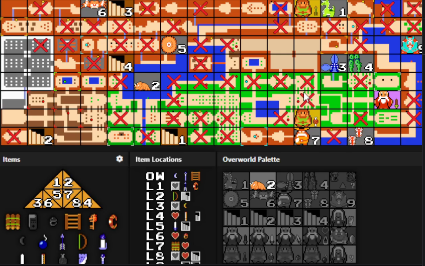
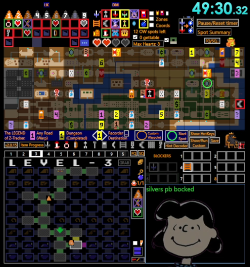

# Map tracker — ideas from other trackers

Scratch notes, not a plan. Nothing here is decided.

## Reference

A community Z1R tracker, captured 2026-08-07. Same underlying map art we use, but
the overlay is doing considerably more work.

## What it does that we don't

**A checked screen is a full-cell red X.** This is the strongest thing in the
image. By the end of a run most of the map is X'd, and the eye skips all of it
instantly — what's left unmarked *is* the remaining search space. Our `visited`
mark is a small dimmed icon in the centre, which is quiet enough that a cleared
screen and an untouched one look similar at a glance. We made it quiet
deliberately; this suggests the opposite instinct is right. The mark isn't there
to be read, it's there to be *skipped*, and a big X does that better than a
small grey dot.

**Screens carry several facts at once, via corner pips.** Small coloured dots sit
in cell corners — multiple per cell, independent of the main marker. Our model
allows exactly one mark per screen, so a screen that is both a shop and a
bombable wall can't say so. Pips would let secondary attributes ride along
without competing with the centre icon.

**The numbered staircases are warp travel, not dungeon entrances.** Corrected by
Bryan — I had misread these. Z1's overworld has stair caves that teleport you
between fixed points, and the numeral pairs the two ends of a route. That is a
whole category of information we cannot record at all: a stairway is not a
dungeon, a shop, an item or a dead end, and its whole value is knowing *where
the other end comes out*.

This is the most interesting thing in the screenshot, and bigger than the
cosmetic items below — it is a new mark kind plus a pairing between two screens,
which nothing in our model currently does. Sketch:

- A `stairway` mark, with a route number (1..n) as its detail.
- Two screens sharing a number are the two ends of one route.
- The cell could say where it goes — "→ D4" — which is the actual question
  ("if I take this, where do I come out?").
- Wants validation: a third screen taking a number already used twice is
  probably a mistake worth surfacing rather than silently allowing.

Separately, and still true: **their dungeon numerals are larger and higher
contrast than ours**, which draws a small `7` in the detail line. Easier to pick
out of a busy map.

**Far more marker variety.** The "Overworld Palette" panel is a persistent grid
of every marker: numbered dungeon entrances, bosses, NPCs, cave types. Greyed
entries appear to be unused-so-far. We deliberately cut to seven, and the reasons
still hold — terrain is already visible in the art behind each cell — but the
*boss* icons are interesting, since which boss is in which dungeon is real
randomizer information we have nowhere to put.

**Item locations show sprites, not letter codes.** Their `L1`…`L8` rows carry the
actual item art inline. We show `F` / `S` / `H` chips and only draw the sprite
once an item is known. Sprites read faster.

## What we already do better

- Marks carry structured detail — which level, what a shop sells, what blocked
  you. Theirs looks like icon-only.
- Hint regions are built into the grid; a hint lights up its screens.
- The map is one canvas, sharp at any dock size.
- Everything survives without colour vision. A palette that leans on coloured
  pips would need care here — pips are small, and small plus colour-only is the
  worst combination for it.

## Candidates, cheapest first

1. Make `visited` a bold full-cell X. Small change, probably the biggest single
   readability win in the list.
2. Larger, higher-contrast dungeon numerals.
3. Sprites instead of letter chips in the compact location rows.
4. Corner pips for secondary attributes — needs a model change (a screen would
   gain a set of tags alongside its mark) and needs a non-colour channel per pip.
5. Boss-per-dungeon tracking. Real information, no obvious home yet; possibly
   belongs with the dungeon's blockers rather than on the map.
6. Stairway/warp routes — the largest of these, and the only one that adds a
   relationship *between* two screens rather than more detail on one.

---

# Z-Tracker — ideas beyond the map

Z-Tracker v2.0.15, captured 2026-09-06. Identified from the "The LEGEND of
Z-Tracker" label and version string in the screenshot. Everything below is read
off the image; I have not run it or read its source.

Notes here go past the overworld map, which is what this file was originally
about.

## Dungeon room tracker

Bottom-left is a per-level room grid, labeled "LEVEL - 3", eight columns
numbered 1-8. Cells carry room-level detail: arrows, colored marks, what look
like door or passage indicators, and item glyphs.

We track a level as a count of item slots and a Triforce boolean. Nothing
records the inside of a dungeon at all — which rooms are mapped, where the
staircases went, which doors are still shut. That is a second grid per level,
not a variation on anything we have.

Open questions before any of it is worth building:

- Rooms per level and their shape. Z1 dungeon maps are 8x8 with only some cells
  used, and the used set differs per level and per quest.
- What a room cell needs to hold. Visited, has item, door states on four sides,
  staircase — the door states are the part that would make it more than a
  checklist.
- Whether it belongs in the map dock, its own dock, or the main dock.

## Blockers, per level rather than per screen

Right of the room grid is a "BLOCKERS" panel: rows numbered 1-8, each a strip
of small boxes.

Ours hangs blockers off the map screen the dungeon sits on. Theirs is a table
keyed by level, readable in one place without hunting across the map. Both hold
the same facts; theirs answers "what am I waiting on, across all levels" in one
look, which is the question asked when a new item drops.

Worth considering as a second view of the same data rather than a replacement —
the data already lives per level in our model, since blockers travel with the
dungeon when it moves.

## Computed counters

Top-center: "12 OW spots left", "0 gettable", "Max Hearts: 8".

These are derived, not entered. We compute nothing of this kind — every number
we show is a count of what the user typed. "Gettable" in particular implies a
reachability model, which `logic.ts` deliberately does not have, and the comment
there gives the reason: item placement and dungeon entrances shuffle with
settings, so any "in logic" claim is wrong under some seed.

"Spots left" needs no such model and is the cheaper one: total known spots minus
those recorded. That is arithmetic over data we already hold.

## Compactness

The whole thing is 515x549 with every panel visible at once and no scrolling.
Ours needs a dock plus a second window for the map, and folds panels to fit.

Contributors visible in the image, without having measured any of them:

- Item icons are packed edge to edge with no cell padding, borders, or gaps.
- No panel headings. Sections are separated by position and a hairline, not by
  a labeled bar.
- The overworld grid cells are smaller than ours and carry more per cell.
- Text is a small pixel font throughout.

Some of that trades against the color-blindness rule — dropping labels and
borders removes exactly the second channels we rely on. Worth taking the packing
and the missing headings, worth being careful with the rest.

## Auto-tracking

Wanted. Not investigated.

What I know: our three builds are browser pages. A browser page cannot read
emulator memory, so this cannot be a change inside the existing apps — it needs
a process on the machine that reads the emulator and feeds the tracker.

What I do not know, and would need to settle first:

- Which emulator, and what it exposes. This decides everything downstream.
- Whether Z-Tracker actually does auto-tracking, and how. The screenshot does
  not say. I assumed nothing.
- What is worth reading. Inventory is the obvious one. Overworld screen and
  dungeon room would drive the map and any room tracker, and are the ones that
  would make the feature feel like more than a typing saver.
- How the feed reaches the page. The existing sync is localStorage plus a
  BroadcastChannel, both same-origin; a local process would need a socket or an
  HTTP endpoint the page polls.
- What happens when they disagree. Auto-tracking can only add what it observes;
  hints and locations are entered by hand and have no memory address. The
  merge rule is a design decision, not a detail.
